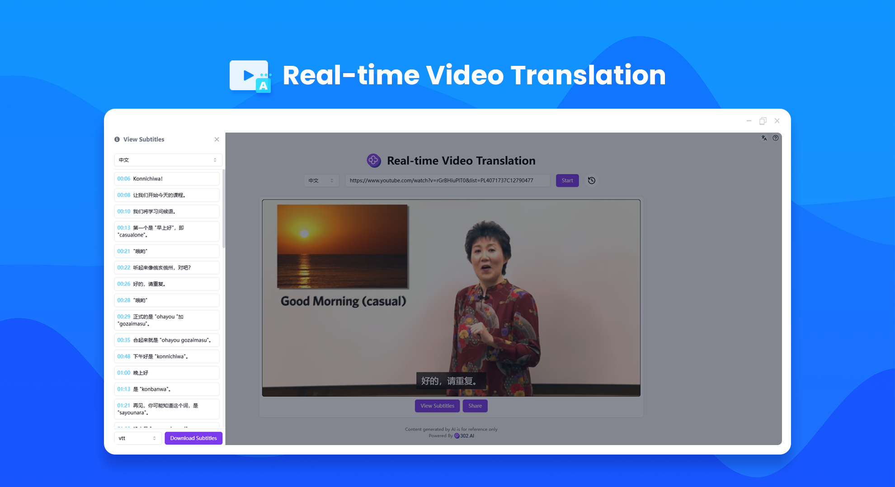

# 
🎥 AI Video Real-time Translation 🚀✨

AI video real-time translation utilizes large language models to conduct real-time translations on video subtitles, supporting platforms like YouTube and Bilibili.

<a href="README_zh.md">中文</a> | <a href="README.md">English</a> | <a href="README_ja.md">日本語</a>

Open-source version of the [AI Video Real-time Translation](https://302.ai/tools/vt/) from [302.AI](https://302.ai).
You can directly log in to 302.AI for a zero-code, zero-configuration online experience.
Alternatively, customize this project to suit your needs, integrate 302.AI's API KEY, and deploy it yourself.

## User Interface Preview
Based on the uploaded video links, the AI will read the videos and perform real-time translations on the video subtitles.

## Project Features
### 🎥 Multi-platform Videos
It supports multi-platform videos, including those from YouTube, TikTok, Bilibili and Douyin.
### 🌍 Multi-language Subtitle Translation
Subtitles can be easily switched among Chinese, English, Japanese, German, French and Korean.
### 📝 Subtitle Download
Subtitle files in VTT, SRT and TXT formats can be obtained.
### 💬 Convenient Sharing
Quickly share wonderful video content with friends.
### 🔄 Multi-language Support
- Chinese
- English
- Japanese
- German
- French
- Korean

With AI Video Real-time Translation, anyone can efficiently access video information! 🎉🎥 Let’s explore the new world of AI-driven information acquisition together! 🌟🚀

## 🚩 Future Update Plans 
- [ ] Increase support for more niche languages
- [ ] Expand the number of video platforms that are compatible
- [ ] Optimize in the multi-language professional fields

## Tech Stack
- Next.js 14
- Tailwind CSS
- Shadcn UI

## Development & Deployment
1. Clone the project `git clone https://github.com/302ai/302_video_translation`
2. Install dependencies `pnpm install`
3. Configure 302's API KEY as per .env.example
4. Run the project `pnpm dev`
5. Build and deploy `docker build -t video-translation . && docker run -p 3000:3000 video-translation`

## ✨ About 302.AI ✨
[302.AI](https://302.ai) is a pay-as-you-go AI application platform, bridging the gap between AI capabilities and practical implementation.
1. 🧠 Comprehensive AI capabilities: Incorporates the latest in language, image, audio, and video models from leading AI brands.
2. 🚀 Advanced application development: We build genuine AI products, not just simple chatbots.
3. 💰 No monthly fees: All features are pay-per-use, fully accessible, ensuring low entry barriers with high potential.
4. 🛠 Powerful admin dashboard: Designed for teams and SMEs - managed by one, used by many.
5. 🔗 API access for all AI features: All tools are open-source and customizable (in progress).
6. 💡 Powerful development team: Launching 2-3 new applications weekly with daily product updates. Interested developers are welcome to contact us.
